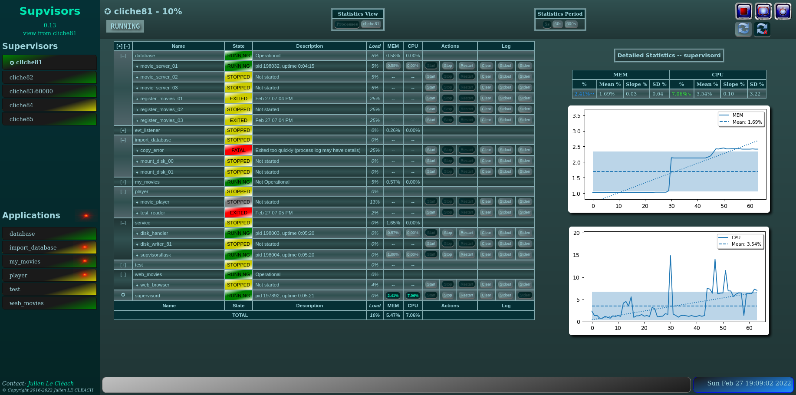

**Supvisors**
=============

**Supvisors** is a Control System for Distributed Applications, based on
multiple instances of Supervisor.

The main features are:

    - a new web-based dashboard that replaces the default dashboard of Supervisor,
    - an extended XML-RPC API to control applications and multiple Supervisor instances,
    - the definition of a rules file to handle:

        * the starting sequence of the applications,
        * the stopping sequence of the applications,
        * the starting strategy of the processes,
        * the strategy to apply when a process crashes.

Supported Platforms
-------------------

**Supvisors** has been tested and is known to run on Linux (CentOS 7.2).
It will likely work fine on most UNIX systems.

**Supvisors** will not run at all under any version of Windows.

**Supvisors** is known to work with Python 2.7 or later but will not work under
any version of Python 3.

Dependencies
-------------

**Supvisors** has dependencies on:

+------------+------------+------------+
| Package    | Release    | Optional   |
+============+============+============+
| Supervisor | 3.3.2      |            |
+------------+------------+------------+
| PyZMQ      | 16.0.2     |            |
+------------+------------+------------+
| psutil     | 4.3.0      |     X      |
+------------+------------+------------+
| netifaces  | 0.10.4     |     X      |
+------------+------------+------------+
| matplotlib | 1.2.0      |     X      |
+------------+------------+------------+
| lxml       | 3.2.1      |     X      |
+------------+------------+------------+

Please note that some of these dependencies may have their own dependencies.

Versions are given for information.
Although **Supvisors** has been developed and tested with these releases,
the minimal release of each dependency is unknown.
Other releases are likely working as well.

Installation
-------------

Supvisors can be installed with ``pip install``:

.. code-block:: bash

   # minimal install (including Supervisor and PyZMQ)
   [bash] > pip install supvisors

   # extra install for all optional dependencies
   [bash] > pip install supvisors[all]

Documentation
-------------

You can view the current **Supvisors** documentation `here
<http://supvisors.readthedocs.io>`_.

You will find detailed installation and configuration documentation.

Reporting Bugs and Viewing the Source Repository
---------------------------------------------------------------

Please report bugs in the `Github issue tracker
<https://github.com/julien6387/supvisors/issues>`_.

You can view the `source repository <https://github.com/julien6387/supvisors>`_
for Supvisors.

Contributing
------------

Not opened yet.

