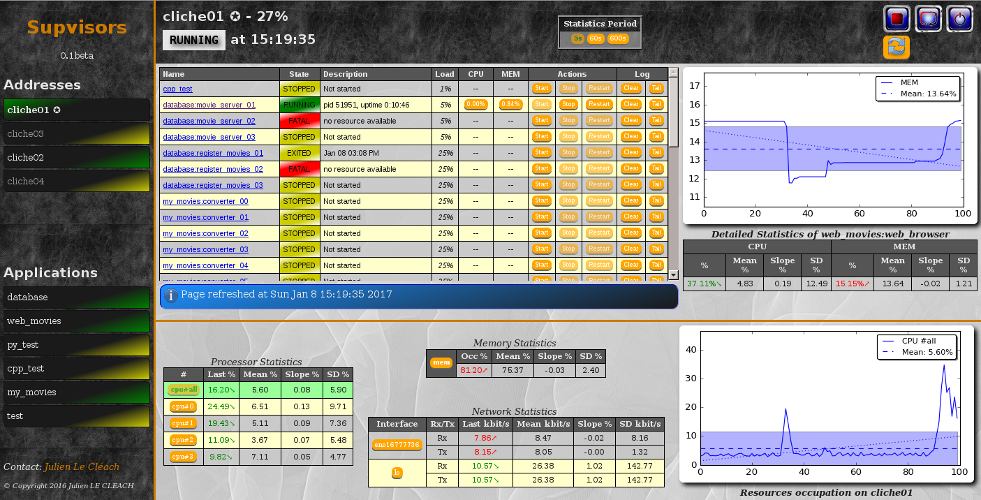

.. _dashboard:

Dashboard
=========

Each Supervisor instance provides a `Web Server <http://supervisord.org/introduction.html#supervisor-components>`_
and the **Supvisors** extension provides its own web user interface, as a replacement of the Supervisor one.

.. attention::

    **Pages are not auto-refreshed.**

    The 'Refresh' button on the top right corner of all pages does the job.

.. note:: *About the browser compliance*.

    The CSS of the web pages has been written for Firefox ESR 45.4.0.
    The compatibility with other browsers or other versions of Firefox is unknown.

All pages are divided into 3 parts:

    * the `Common Menu`_ on the left side,
    * a header on the top right,
    * the contents itself on the lower right.

Common Menu
-----------

.. image:: images/supvisors_menu.png
    :alt: Common Menu
    :align: center

Clicking on the 'Supvisors' title brings the `Main page`_ back or the `Conciliation page`_ if it blinks in red.
The version of **Supvisors** is displayed underneath.

Below is the Addresses part that lists all the addresses defined in the :ref:`supvisors_section` of the Supervisor configuration file.
The color gives the state of the Address, as seen by the **Supvisors** instance that is displaying this page:

    * grey for ``UNKNOWN``,
    * grey-to-green gradient for ``CHECKING``,
    * yellow for ``SILENT``,
    * green for ``RUNNING``,
    * red for ``ISOLATED``.

Only the hyperlinks of the ``RUNNING`` addresses are active. The browser is redirected to the `Address page`_ of the corresponding Web Server.
The **Supvisors** instance playing the role of "Master" is pointed out with the ✪ sign.

Below is the Application part that lists all the applications defined through the
`group sections <http://supervisord.org/configuration.html#group-x-section-settings>`_ of the Supervisor configuration file.
The color gives the state of the Application, as seen by the **Supvisors** instance that is displaying this page:

    * grey for ``UNKNOWN``,
    * yellow for ``STOPPED``,
    * yellow-to-green gradient for ``STARTING``,
    * green-to-yellow gradient for ``STOPPING``,
    * green for ``RUNNING``.

All hyperlinks are active. The browser is redirected to the corresponding `Application page`_ on the local Web Server.

The bottom part of the menu contains a contact link and copyright information.

Main page
---------

The Main page shows a synoptic of the **Supvisors** status.

.. image:: images/supvisors_main_page.png
    :alt: Supvisors Main page
    :align: center

Main page Header
~~~~~~~~~~~~~~~~

The state of **Supvisors** is displayed on the left side of the header:

``INITIALIZATION``
    
    This is the **Supvisors** starting phase, waiting for all **Supvisors** instances to connect themselves.
    Refer to the :ref:`synchronizing` section for more details.

    In this state, the **Supvisors** :ref:`xml_rpc` is restricted so that version, master and address
    information only are available.

``DEPLOYMENT``

    In this state, **Supvisors** is automatically starting applications (here for more details).
    Refer to the :ref:`start_sequence` section for more details.

    The whole :ref:`xml_rpc_status` part and the :ref:`xml_rpc_supvisors` part of the **Supvisors** :ref:`xml_rpc`
    are available from this state.

``OPERATION``

    In this state, **Supvisors** is mainly:
    
        * listening to Supervisor events,
        * publishing the events on its :ref:`event_interface`,
        * checking the activity of all remote **Supvisors** instances,
        * detecting eventual multiple running instances of the same program,
        * providing statistics to its Dashboard.

    The whole **Supvisors** :ref:`xml_rpc` is available in this state.

``CONCILIATION``

    This state is reached when **Supvisors** has detected multiple running instances of the same program.
    **Supvisors** is either solving conflicts itself or waiting for the user to do it.
    Refer to the :ref:`conciliation` section for more details.

    The **Supvisors** :ref:`xml_rpc` is restricted in this state. It is possible to stop applications and processes
    but the start requests are rejected.

``RESTARTING``

    **Supvisors** is stopping all processes before commanding its own restart, i.e. the restart of all Supervisor instances.
    Refer to the :ref:`stop_sequence` section for more details.

    The **Supvisors** :ref:`xml_rpc` is NOT available in this state.

``SHUTTING_DOWN``

    **Supvisors** is stopping all processes before commanding its own shutdown, i.e. the shutdown of all Supervisor instances.
    Refer to the :ref:`stop_sequence` section for more details.

``SHUTDOWN``

    This is the final state of **Supvisors**, in which it remains inactive and waits for the Supervisor stopping event.

    The **Supvisors** :ref:`xml_rpc` is NOT available in this state.

On the right side, 3 buttons are available:

    * |restart| restarts **Supvisors** through all Supervisor instances,
    * |shutdown| shuts down **Supvisors** through all Supervisor instances,
    * |refresh| refreshes the current page.

Main page Contents
~~~~~~~~~~~~~~~~~~

For every addresses, a box is displayed in the contents of the **Supvisors** Main page.
Each box contains:

    * the address name, which is a hyperlink to the corresponding `Address page`_ if the Address state is ``RUNNING``,
    * the state of the Address, colored with the same rules used in the `Common Menu`_,
    * the process loading of the Address,
    * the list of all processes that are running on this address.

Conciliation page
-----------------

If the page is refreshed when **Supvisors** is in ``CONCILIATION`` state, the 'Supvisors' label in the top left of the `Common Menu`_ becomes red and blinks.
This situation is unlikely to happen if the ``conciliation_strategy`` chosen in the :ref:`supvisors_section` of the Supervisor configuration file is different from ``USER``, as the other values will lead to an immediate conciliation of the conflicts.

The Conciliation page can be reached by clicking on this blinking red label.

.. image:: images/supvisors_conciliation_page.png
    :alt: Supvisors Conciliation page
    :align: center

Conciliation page Header
~~~~~~~~~~~~~~~~~~~~~~~~

The header of the Conciliation page has exactly the same contents as the header of the `Main page`_.

Conciliation page Contents
~~~~~~~~~~~~~~~~~~~~~~~~~~

On the right side of the page, the list of process conflicts is displayed into a table.
A process conflict is raised when the same program is running on several hosts.

So the table lists, for each conflict:

    * the name of the program incriminated,
    * the list of addresses where it is running,
    * the uptime of the corresponding process on each address,
    * for each process, a list of actions helping to the solving of this conflict:

        + Stop the process,
        + Keep this process (and Stop all others),

    * for each process, a list of automatic strategies (refer to :ref:`conciliation`) helping to the solving of this conflict.

The left side of the page contains a simple box that enables the user to perform a global conciliation on all conflicts, using one of the automatic strategies.

Address page
------------

The Address page of **Supvisors** is a bit less "sparse" than the web page provided by Supervisor.
It shows the status of the address, as seen by the local **Supvisors** instance.
It also enables the user to command the processes declared on this address and provides statistics that may be useful at software integration time.

Address page Header
~~~~~~~~~~~~~~~~~~~

The status of the Address is displayed on the left side of the header:

    * the name of the address, marked with the ✪ sign if it corresponds to the "Master",
    * the current loading of the processes running on this address,
    * the state of this address,
    * the date of the last tick received from Supervisor on this address.

In the middle of the header, the 'Statistics Period' box enables the user to choose the period used for the statistics of this page.
The periods can be updated in the :ref:`supvisors_section` of the Supervisor configuration file.

On the right side, 4 buttons are available:

    * |stop| stops all processes handled by Supervisor on this address,
    * |restart| restarts Supervisor on this address,
    * |shutdown| shuts down Supervisor on this address,
    * |refresh| refreshes the current page.

Address page Contents
~~~~~~~~~~~~~~~~~~~~~

The contents of the Address page is divided in two parts.

The upper part looks like the page provided by Supervisor.
Indeed, it lists the programs that are configured in Supervisor, it presents their current state with an associated description and enables the user to perform some actions on them:

    * log tail (with a refresh button, click on the name itself),
    * Start,
    * Stop,
    * Restart,
    * Clear log,
    * Tail log (auto-refreshed).

**Supvisors** shows additional information for each process, such as:

    * the loading declared for the process in the rules file,
    * the CPU usage of the process during the last period (only if the process is ``RUNNING``),
    * the instant memory (Resident Set Size) occupation of the process at the last period tick (only if the process is ``RUNNING``),

A click on the CPU or RAM measures shows detailed statistics about the process.
More particularly, **Supvisors** shows a graph built from the series of measures taken from the selected resource:

    * the history of the values with a plain line,
    * the mean value with a dashed line and value in the top right corner,
    * the linear regression with a straight dotted line,
    * the standard deviation with a colored area around the mean value.

Underneath is a table showing for both CPU and Memory:

    * the last measure,
    * the mean value,
    * the value of the slope of the linear regression,
    * the value of the standard deviation.

A color and a sign are associated to the last value, so that:

    * green and ↗ point out a significant increase of the value since the last measure,
    * red and ↘ point out a significant decrease of the value since the last measure,
    * blue and ↝ point out the stability of the value since the last measure,

The lower part of the page contains CPU, Memory and Network statistics for the considered address.

The CPU table shows statistics about the CPU on each core of the processor and about the average CPU of the processor.

The Memory table shows statistics about the amount of used (and not available) memory.

The Network table shows statistics about the receive and sent flows on each network interface.

Clicking on a button associated to the resource displays detailed statistics (graph and table), similarly to the process buttons.

Application page
----------------

The Application page of **Supvisors** shows the status of the application, as seen by the requested **Supvisors** instance, enables the user to command the application and its processes, and provides statistics that may be useful at software integration time.

.. image:: images/supvisors_application_page.png
    :alt: Supvisors Application page
    :align: center

Application page Header
~~~~~~~~~~~~~~~~~~~~~~~

The status of the Address is displayed on the left side of the header:

    * the name of the application,
    * the state of this address,
    * a led corresponding to the operational status of the application:

        + empty if not ``RUNNING``,
        + red if ``RUNNING`` and at least one major failure is detected,
        + orange if ``RUNNING`` and at least one minor failure is detected, and no major failure,
        + green if ``RUNNING`` and no failure is detected.

The second part of the header is the 'Deployment strategy' box that enables the user to choose the strategy to start the application programs listed below.

Strategies are detailed in :ref:`start_sequence`.

The third part of the header is the 'Statistics Period' box that enables the user to choose the period used for the statistics of this page. The periods can be updated in the :ref:`supvisors_section` of the Supervisor configuration file.

On the right side, 4 buttons are available:

    * |start| starts the application,
    * |stop| stops the application,
    * |restart| restarts the application,
    * |refresh| refreshes the current page.

Application page Contents
~~~~~~~~~~~~~~~~~~~~~~~~~

The table lists all the programs belonging to the application, and it shows:

    * the 'synthetic' state of the process (refer to this note for details about the synthesis),
    * the address where it runs, if appropriate,
    * the loading declared for the process in the deployment file,
    * the CPU usage of the process during the last period (only if the process is ``RUNNING``),
    * the instant memory (Resident Set Size) occupation of the process at the last period tick (only if the process is ``RUNNING``).

Like the `Address page`_, the Application page enables the user to perform some actions on programs:

    * Start,
    * Stop,
    * Restart.

The difference is that the process is not started necessarily on the address that displays this page.
Indeed, **Supvisors** uses the rules of the program (as defined in the rules file) and the deployment strategy selected in the header part to choose a relevant address.

As previously, a click on the CPU or RAM measures shows detailed statistics about the process.

.. |start| image:: images/start_button.png
    :alt: Start button

.. |stop| image:: images/stop_button.png
    :alt: Stop button

.. |restart| image:: images/restart_button.png
    :alt: Restart button

.. |shutdown| image:: images/shutdown_button.png
    :alt: Shutdown button

.. |refresh| image:: images/refresh_button.png
    :alt: Refresh button

