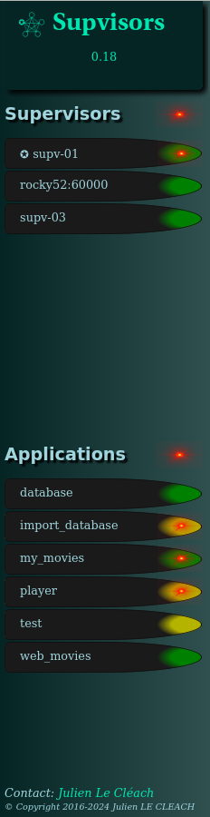
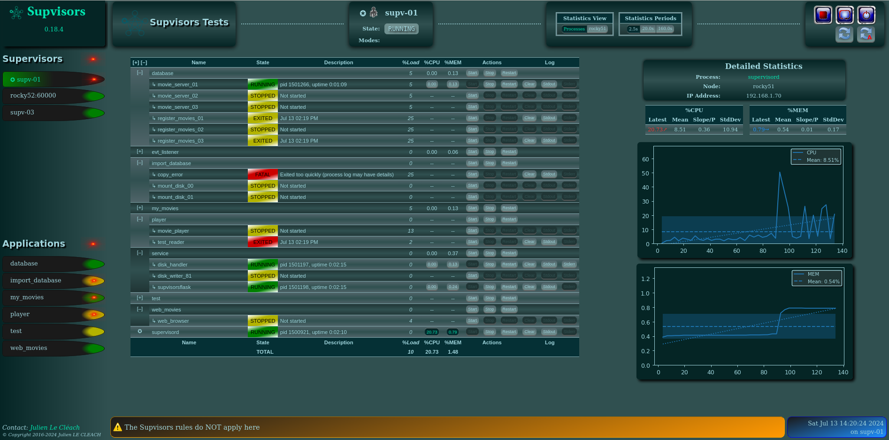

.. _dashboard:

Dashboard
=========

Each |Supervisor| instance provides a `Web Server <http://supervisord.org/introduction.html#supervisor-components>`_
and the |Supvisors| extension provides its own Web User Interface, as a replacement of the |Supervisor| one but using
the same infrastructure.

.. note::

    The information displayed in the Web User Interface is a synthesis of the information provided by all |Supvisors|
    instances and as perceived by the |Supvisors| instance that displays the web pages.

.. important:: *About the browser compliance*.

    The CSS of the web pages has been written for Firefox ESR 91.3.0.
    The compatibility with other browsers or other versions of Firefox is unknown.

All pages are divided into 3 parts:

    * the `Common Menu`_ on the left side ;
    * a header on the top right ;
    * the content itself on the lower right.

Common Menu
-----------

Clicking on the 'Supvisors' title brings the `Main page`_ back or the `Conciliation page`_ if it blinks in red.
The version of |Supvisors| is displayed underneath. There's also a reminder of the |Supvisors| instance that provides
the information.

Below is the **Supervisors** part that lists all the |Supvisors| instances defined in the :ref:`supvisors_section`
of the |Supervisor| configuration file.
The color gives the state of the |Supvisors| instance:

    * grey for ``UNKNOWN`` ;
    * grey-to-green gradient for ``CHECKING`` ;
    * yellow for ``SILENT`` ;
    * green for ``RUNNING`` ;
    * red for ``ISOLATED``.

Only the hyperlinks of the ``RUNNING`` |Supvisors| instances are active.
The browser is redirected to the `Supervisor page`_ of the targeted |Supvisors| instance.
The |Supvisors| instance playing the role of *Master* is pointed out with the ✪ sign.

Below is the **Applications** part that lists all the *Managed* applications defined through the
`group sections <http://supervisord.org/configuration.html#group-x-section-settings>`_
of the |Supervisor| configuration file and also declared in the |Supvisors| :ref:`rules_file`.
The color gives the state of the Application, as seen by the |Supvisors| instance that is displaying this page:

    * grey for ``UNKNOWN`` ;
    * yellow for ``STOPPED`` ;
    * yellow-to-green gradient for ``STARTING`` ;
    * green-to-yellow gradient for ``STOPPING`` ;
    * green for ``RUNNING``.

An additional red light is displayed in the event where a failure has been raised on the application.
All hyperlinks are active. The browser is redirected to the corresponding `Application page`_ on the local Web Server.

The bottom part of the menu contains a contact link and copyright information.

Common footer
-------------

The bottom part of all pages displays two information areas:

    * the acknowledgement area, used to print the result of the actions requested from the buttons of the Web UI ;
    * the time when the page has been generated.

Depending on the result, the acknowledgement area may have a different background color:

    * grey by default, when no action is pending ;
    * blue for a successful result ;
    * amber when an action could not be performed but when the result is already as expected (e.g. a process is already
      started) ;
    * amber too as an acknowledgement of an action having a major impact (e.g. a shutdown or a restart) ;
    * red in the event of an error (e.g. start / stop failed).

.. _dashboard_main:

Main Page
---------

The Main Page shows a synoptic of the |Supvisors| status.

.. image:: images/supvisors_main_page.png
    :alt: Supvisors Main page
    :align: center

Main Page Header
~~~~~~~~~~~~~~~~

The |Supvisors| state is displayed on the left side of the header:

``INITIALIZATION``
    
    This is the |Supvisors| starting phase, waiting for all |Supvisors| instances to connect themselves.
    Refer to the :ref:`synchronizing` section for more details.

    In this state, the |Supvisors| :ref:`xml_rpc` is restricted so that only version, master and |Supvisors| instance
    information are available.

``DEPLOYMENT``

    In this state, |Supvisors| is automatically starting applications. Refer to the :ref:`starting_strategy` section
    for more details.

    The whole :ref:`xml_rpc_status` part and the :ref:`xml_rpc_supvisors` part of the |Supvisors| :ref:`xml_rpc`
    are available from this state.

``OPERATION``

    In this state, |Supvisors| is mainly:
    
        * listening to |Supervisor| events ;
        * publishing the events on its :ref:`event_interface` ;
        * checking the activity of all remote |Supvisors| instances ;
        * detecting eventual multiple running instances of the same program ;
        * providing statistics to its Dashboard.

    The whole |Supvisors| :ref:`xml_rpc` is available in this state.

``CONCILIATION``

    This state is reached when |Supvisors| has detected multiple running instances of the same program.
    |Supvisors| is either solving conflicts itself or waiting for the user to do it.
    Refer to the :ref:`conciliation` section for more details.

    The |Supvisors| :ref:`xml_rpc` is restricted in this state. It is possible to stop applications and processes
    but the start requests are rejected.

``RESTARTING``

    |Supvisors| is stopping all processes before commanding its own restart, i.e. the restart
    of all |Supvisors| instances including a restart of their related |Supervisor|.
    Refer to the :ref:`stopping_strategy` section for more details.

    The |Supvisors| :ref:`xml_rpc` is NOT available in this state.

``SHUTTING_DOWN``

    |Supvisors| is stopping all processes before commanding its own shutdown, i.e. the shutdown
    of all |Supvisors| instances including a restart of their related |Supervisor|.
    Refer to the :ref:`stopping_strategy` section for more details.

    The |Supvisors| :ref:`xml_rpc` is NOT available in this state.

``SHUTDOWN``

    This is the final state of |Supvisors|, in which it remains inactive and waits for the |Supervisor| stopping event.
    This state is unlikely to be displayed.

    The |Supvisors| :ref:`xml_rpc` is NOT available in this state.

The |Supvisors| modes are displayed alongside the state if activated:

``starting``

    This mode is visible and blinking when the ``Starter`` of any of the |Supvisors| instances has jobs in progress.

``stopping``

    This mode is visible and blinking when the ``Stopper`` of any of the |Supvisors| instances has jobs in progress.

On the right side, 3 buttons are available:

    * |restart| restarts |Supvisors| through all |Supvisors| instances ;
    * |shutdown| shuts down |Supvisors| through all |Supvisors| instances ;
    * |refresh| refreshes the current page ;
    * |autorefresh| refreshes the current page and sets a periodic 5s refresh to the page.

Main Page Contents
~~~~~~~~~~~~~~~~~~

For every |Supvisors| instances, a box is displayed in the contents of the |Supvisors| Main Page.
Each box contains:

    * the |Supvisors| instance deduced name, which is a hyperlink to the corresponding `Supervisor Page`_
      if the |Supvisors| instance is in the ``RUNNING`` state ;
    * the |Supvisors| instance state, colored with the same rules used in the `Common Menu`_ ;
    * the |Supvisors| instance process loading ;
    * the list of all processes that are running in this |Supvisors| instance, whatever they belong to a *Managed*
      application or not.

Conciliation Page
-----------------

If the page is refreshed when |Supvisors| is in ``CONCILIATION`` state, the 'Supvisors' label in the top left
of the `Common Menu`_ becomes red and blinks.
This situation is unlikely to happen if the ``conciliation_strategy`` chosen in the :ref:`supvisors_section`
of the |Supervisor| configuration file is different from ``USER``, as the other values will trigger an immediate and
automatic conciliation of the conflicts.

The Conciliation Page can be reached by clicking on this blinking red label.

.. image:: images/supvisors_conciliation_page.png
    :alt: Supvisors Conciliation Page
    :align: center

Conciliation Page Header
~~~~~~~~~~~~~~~~~~~~~~~~

The header of the Conciliation Page has exactly the same contents as the header of the `Main page`_.

Conciliation Page Contents
~~~~~~~~~~~~~~~~~~~~~~~~~~

On the right side of the page, the list of process conflicts is displayed into a table.
A process conflict is raised when the same program is running in multiple |Supvisors| instances.

So the table lists, for each conflict:

    * the name of the program incriminated ;
    * the list of |Supvisors| instances where it is running ;
    * the uptime of the corresponding process in each |Supvisors| instance ;
    * for each process, a list of actions helping to the solving of this conflict:

        + Stop the process ;
        + Keep this process (and stop all others) ;

    * for each process, a list of automatic strategies (refer to :ref:`conciliation`) helping to the solving
      of this conflict.

The left side of the page contains a simple box that enables the user to perform a global conciliation on all conflicts,
using one of the automatic strategies proposed by |Supvisors|.

Supervisor Page
---------------

The *Supervisor* Page of |Supvisors| is the page that most closely resembles the legacy |Supervisor| page,
hence its name, although it is a bit less "sparse" than the web page provided by |Supervisor|.
It shows the status of the |Supvisors| instance, as seen by the |Supvisors| instance itself as this page is always
re-directed accordingly.
It also enables the user to command the processes declared in this |Supvisors| instance and provides statistics
that may be useful at software integration time.

Supervisor Page Header
~~~~~~~~~~~~~~~~~~~~~~

The status of the |Supvisors| instance is displayed on the left side of the header:

    * the |Supvisors| instance deduced name, marked with the ✪ sign if it is the *Master* ;
    * the current loading of the processes running in this |Supvisors| instance ;
    * the |Supvisors| instance state and modes.

.. note::

    The |Supvisors| instance modes are visible and blinking when the ``Starter`` or the ``Stopper`` of the considered
    |Supvisors| instance has jobs in progress.
    It doesn't mean that a process is starting or stopping in the local |Supervisor|.
    It means that the |Supvisors| instance is managing a start or a stop sequence, which could lead to processes being
    started or stopped on any other |Supervisor| instance managed by |Supvisors|.

In the middle of the header, the 'Statistics View' box enables the user to choose the information presented
on this page.
By default, the `Processes Section`_ is displayed. The other choice is the `Host Section`_. The *Host* button is named
after the name of the node hosting the |Supvisors| instance.
The periods can be updated in the :ref:`supvisors_section` of the |Supervisor| configuration file.

Next to it, the 'Statistics Period' box enables the user to choose the period used for the statistics of this page.
The periods can be updated in the :ref:`supvisors_section` of the |Supervisor| configuration file.

On the right side, 5 buttons are available:

    * |stop| stops all the processes handled by |Supervisor| in this |Supvisors| instance ;
    * |restart| restarts this |Supvisors| instance, including |Supervisor| ;
    * |shutdown| shuts down this |Supvisors| instance, including |Supervisor| ;
    * |refresh| refreshes the current page ;
    * |autorefresh| refreshes the current page and sets a periodic 5s refresh to the page.

Processes Section
~~~~~~~~~~~~~~~~~

The **Processes Section** looks like the page provided by |Supervisor|.
Indeed, it lists the programs that are configured in |Supervisor|, it presents their current state with an associated
description and enables the user to perform some actions on them:

    * Log tail (with a refresh button, click on the program name itself) ;
    * Start ;
    * Stop ;
    * Restart ;
    * Clear log ;
    * Tail stdout log (auto-refreshed) ;
    * Tail stderr log (auto-refreshed).

|Supvisors| shows additional information for each process, such as:

    * the loading declared for the process in the rules file ;
    * the CPU usage of the process during the last period (only if the process is ``RUNNING``) ;
    * the instant memory (Resident Set Size) occupation of the process at the last period tick (only if the process
      is ``RUNNING``).

.. note::

    For ``RUNNING`` processes, the color gradient used is different if the process has ever crashed since Supvisors
    has been started. The aim is to inform that process logs should be considered.

    +------------------------------------+-------------------------------------------+
    | 'standard' ``RUNNING`` process     | ``RUNNING`` process with a crash history  |
    +====================================+===========================================+
    | .. centered:: |standard_running|   | .. centered:: |crashed_running|           |
    +------------------------------------+-------------------------------------------+

All processes are grouped by their application name and |Supvisors| provides expand / shrink actions per application
to enable the user to show / hide blocks of processes. Global expand / shrink actions are provided too in the top left
cell of the table. The application line displays:

    * the overall state of the application, considering all |Supvisors| instances where it may be distributed,
    * a basic description of the operational status of the application,
    * considering the application processes that are running in this |Supvisors| instance:

        * the sum of their expected loading ;
        * the sum of their CPU usage ;
        * the sum of their instant memory occupation.

A click on the CPU or RAM measures shows detailed statistics about the process. This is not active
on the application values.
More particularly, |Supvisors| displays on the right side of the page a table showing for both CPU and Memory:

    * the last measure ;
    * the mean value ;
    * the value of the slope of the linear regression built ;
    * the value of the standard deviation.

A color and a sign are associated to the last value, so that:

    * green and ↗ point out an increase of the value since the last measure ;
    * red and ↘ point out a decrease of the value since the last measure ;
    * blue and ↝ point out the stability of the value since the last measure.

Underneath, |Supvisors| shows two graphs (CPU and Memory) built from the series of measures taken
from the selected process:

    * the history of the values with a plain line ;
    * the mean value with a dashed line and value in the top right corner ;
    * the linear regression with a straight dotted line ;
    * the standard deviation with a colored area around the mean value.

Host Section
~~~~~~~~~~~~

.. image:: images/supvisors_address_host_section.png
    :alt: Host Section of Supvisors Address Page
    :align: center

The Host Section contains CPU, Memory and Network statistics for the considered node.

The CPU table shows statistics about the CPU on each core of the processor and about the average CPU of the processor.

The Memory table shows statistics about the amount of used (and not available) memory.

The Network table shows statistics about the receive and sent flows on each network interface.

Clicking on a button associated to the resource displays detailed statistics (graph and table),
similarly to the process buttons.

.. _dashboard_application:

Application Page
----------------

The Application Page of |Supvisors|:

    * shows the status of the *managed* application, as seen by the considered |Supvisors| instance ;
    * enables the user to command the application and its processes ;
    * provides statistics that may be useful at software integration time.

.. image:: images/supvisors_application_page.png
    :alt: Supvisors Application page
    :align: center

Application Page Header
~~~~~~~~~~~~~~~~~~~~~~~

The status of the Application is displayed on the left side of the header, including:

    * the name of the application ;
    * the state of the application ;
    * a led corresponding to the operational status of the application:

        + empty if not ``RUNNING`` ;
        + red if ``RUNNING`` and at least one major failure is detected ;
        + orange if ``RUNNING`` and at least one minor failure is detected, and no major failure ;
        + green if ``RUNNING`` and no failure is detected.

The second part of the header is the 'Starting strategy' box that enables the user to choose the strategy
to start the application programs listed below.

Strategies are detailed in :ref:`starting_strategy`.

The third part of the header is the 'Statistics Period' box that enables the user to choose the period used
for the statistics of this page. The periods can be updated in the :ref:`supvisors_section`
of the |Supervisor| configuration file.

On the right side, 4 buttons are available:

    * |start| starts the application ;
    * |stop| stops the application ;
    * |restart| restarts the application ;
    * |refresh| refreshes the current page ;
    * |autorefresh| refreshes the current page and sets a periodic 5s refresh to the page.

Application Page Contents
~~~~~~~~~~~~~~~~~~~~~~~~~

The table lists all the programs belonging to the application, and it shows:

    * the 'synthetic' state of the process (refer to this note for details about the synthesis) ;
    * the |Supvisors| instances where it runs, if appropriate ;
    * the description (after initialization from |Supervisor|, the deduced name of the corresponding |Supvisors|
      instance is added depending on the state) ;
    * the loading declared for the process in the rules file ;
    * the CPU usage of the process during the last period (only if the process is ``RUNNING``) ;
    * the instant memory (Resident Set Size) occupation of the process at the last period tick (only if the process
      is ``RUNNING``).

Like the `Supervisor page`_, the Application page enables the user to perform some actions on programs:

    * Start ;
    * Stop ;
    * Restart ;
    * Clear log ;
    * Tail stdout log (auto-refreshed) ;
    * Tail stderr log (auto-refreshed).

The difference is that the process is not started necessarily in the |Supvisors| instance that displays this page.
Indeed, |Supvisors| uses the rules of the program (as defined in the rules file) and the starting strategy selected
in the header part to choose a relevant |Supvisors| instance. If no rule is defined for the program, the starting
will fail.

As previously, a click on the CPU or Memory measures shows detailed statistics about the process.

.. include:: common.rst

