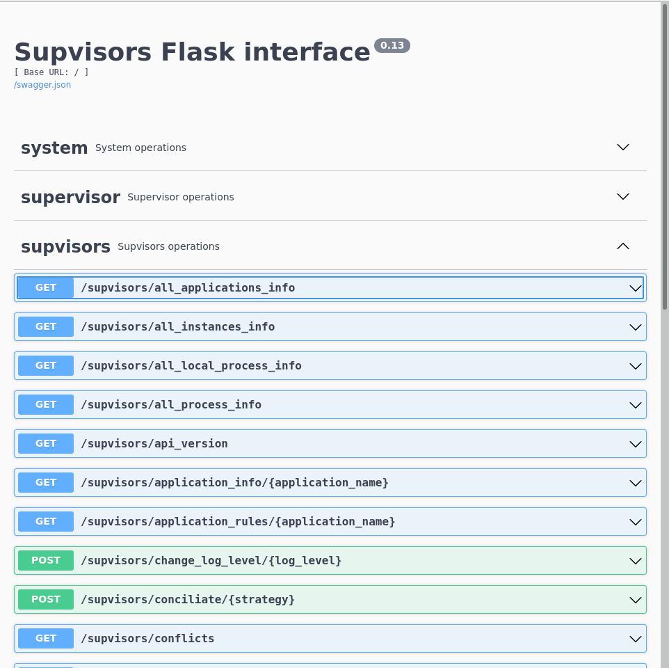
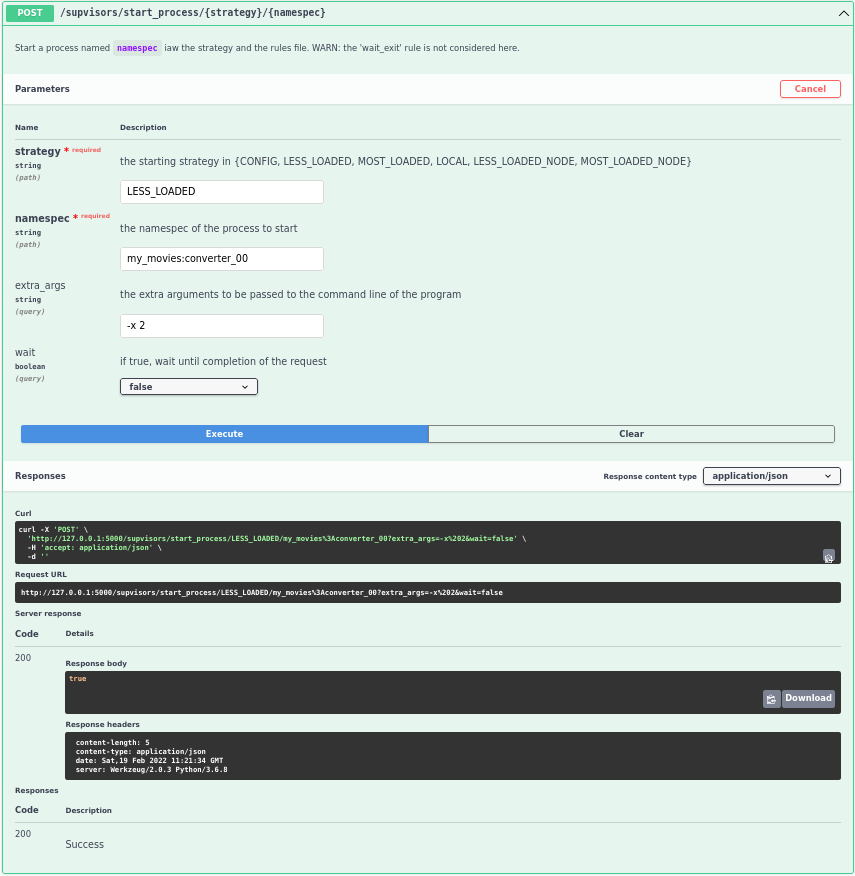

.. _rest_api:

REST API
========

:command:`supvisorsflask` is a |Supvisors| |Flask-RESTX| application that is added to the ``BINDIR``.
It exposes the |Supervisor| and |Supvisors| XML-RPC API through a REST API.

.. note::

    An exception however: the |Supervisor| ``system.multicall`` XML-RPC has not been implemented.

Starting the `Flask-RESTX` application
--------------------------------------

The program :command:`supvisorsflask` requires 2 main information to work:

    * the URL of the |Supervisor| instance to address the XML-RPCs,
    * the URL of the |Flask| web server to which the REST API will be exposed.

If :command:`supvisorsflask` is spawned by |Supervisor|, it naturally gets the URL of the |Supervisor| instance through
the ``SUPERVISOR_SERVER_URL`` environment variable. Otherwise, this URL must be passed using the ``-u SUPERVISOR_URL``
option.

Default values for ``HOST`` and ``PORT`` are the |Flask| default values, i.e. the application will run the web server
on ``http://127.0.0.1:5000``.

.. code-block:: bash

    [bash] > supvisorsflask --help
    usage: supvisorsflask [--help] -u SUPERVISOR_URL [-h HOST] [-p PORT] [-d]

    Start a Flask application to interact with Supvisors

    optional arguments:
      --help                show this help message and exit
      -u SUPERVISOR_URL, --supervisor_url SUPERVISOR_URL
                            the Supervisor URL, required if supvisorsflask is not
                            spawned by Supervisor
      -h HOST, --host HOST  the Flask server IP address
      -p PORT, --port PORT  the Flask server port number
      -d, --debug           the Flask Debug mode

Using the REST API
------------------

The aim of the present documentation is not to be a REST API tutorial. So here follows just a few usage examples with
:command:`curl` and :command:`python`. Of course, many other programming languages will provide an API to perform
such requests.

:command:`curl` commands
~~~~~~~~~~~~~~~~~~~~~~~~

A first possibility is to use :command:`curl` commands in a shell.

.. code-block:: bash

    [bash] > curl -X 'GET' 'http://localhost:5000/supvisors/supvisors_state' -H 'accept: application/json'
    {"fsm_statecode": 3, "fsm_statename": "OPERATION", "starting_jobs": [], "stopping_jobs": []}

    [bash] > curl -X 'POST' \
        'http://127.0.0.1:5000/supvisors/start_process/CONFIG/my_movies%3Aconverter_00?extra_args=-x%202&wait=false' \
        -H 'accept: application/json'
    true

|Supervisor| XML-RPC exceptions will return a payload including the fault message and code.

.. code-block:: bash

    [bash] > curl -X 'GET' 'http://localhost:5000/supvisors/application_info/dummy' -H 'accept: application/json'
    {"message": "BAD_NAME: application dummy unknown to Supvisors", "code": 10}

    [bash] > curl -X 'POST' \
        'http://127.0.0.1:5000/supvisors/start_process/CONFIG/my_movies%3Aconverter_00?extra_args=-x%202&wait=false' \
        -H 'accept: application/json'
    {"message": "ALREADY_STARTED: my_movies:converter_00", "code": 60}

:command:`Python` requests
~~~~~~~~~~~~~~~~~~~~~~~~~~

Here is a possibility using the :command:`Python` module `Requests <https://docs.python-requests.org>`_.
All results are a :program:`JSON` string.

>>> import json, requests
>>> res = requests.get('http://localhost:5000/supvisors/supvisors_state')
>>> print(res.text)
{"fsm_statecode": 3, "fsm_statename": "OPERATION", "starting_jobs": [], "stopping_jobs": []}
>>> print(json.loads(res.text))
{'fsm_statecode': 3, 'fsm_statename': 'OPERATION', 'starting_jobs': [], 'stopping_jobs': []}
>>> res = requests.post(f'http://localhost:5000/supvisors/start_process/LESS_LOADED/my_movies%3Aconverter_01?extra_args=-x%201&wait=true')
>>> print(json.loads(res.text))
{'message': 'ABNORMAL_TERMINATION: my_movies:converter_01', 'code': 40}

Using the Swagger UI
--------------------

An interest in using |Flask-RESTX| over |Flask| is to benefit from a documented Web UI when connecting a browser to the
URL defined above.

The Web UI allows to test the REST API proposed.

.. include:: common.rst
